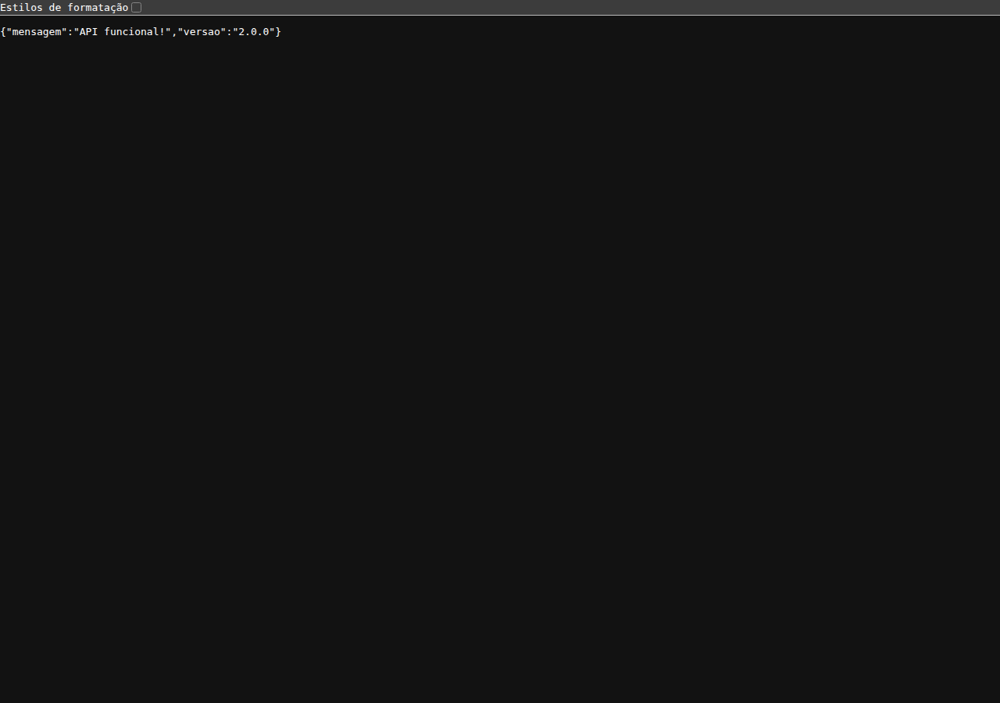

# Backend JWT

API REST em **Node.js + Express + MongoDB** com autenticação JWT completa (access token + refresh token), CRUD de usuários e produtos, pronta para Docker.

## Badges


## Problema → Solução

**Problema:** proteger uma API Node/Express/MongoDB com autenticação robusta e escalável, sem depender de plataformas externas de identidade.

**Solução:** autenticação stateless com **JWT** — access token de curta duração (1h) e refresh token de longa duração (30 dias, revogável e persistido no MongoDB). Senhas com **bcrypt**, proteção de cabeçalhos com **helmet**, **rate limiting** e validação de payload com **express-validator**.

## Arquitetura

```
Cliente ──► Express (helmet + cors + rate-limit)
              │
              ├── GET    /            → health/versão
              ├── /usuario  (Auth)     → novo | login | refresh-token | logout | eu
              ├── /produto (CRUD)      → GET | GET/:id | POST | PUT/:id | DELETE/:id
              │
              └── middleware/auth.js   → valida assinatura JWT
                      │
                      ▼
              mongoose ──► MongoDB
```

Fluxo de autenticação:

```
POST /usuario/novo ─registro─► { accessToken (1h), refreshToken (30d) }
POST /usuario/login ────────► { accessToken (1h), refreshToken (30d) }
GET  /produto (Authorization/header `token` ou `x-access-token`) ─► valida JWT ─► responde
POST /usuario/refresh-token ─► emite novo accessToken
POST /usuario/logout ───────► revoga todos os refresh tokens do usuário
```

## Stack

| Camada        | Tecnologia                              |
|---------------|-----------------------------------------|
| Linguagem     | Node.js 18+                             |
| Framework     | Express 4                               |
| Banco de dados| MongoDB + Mongoose 8                    |
| Autenticação  | JWT (jsonwebtoken) + bcryptjs           |
| Segurança     | helmet, express-rate-limit              |
| Validação     | express-validator                       |
| Testes        | Jest + Supertest + mongodb-memory-server|
| Infra         | Docker + docker-compose                 |

## Quickstart

### Docker (recomendado)

```bash
docker compose up --build
```

A API sobe em `http://localhost:4000` junto com o MongoDB.

### Local

```bash
npm ci
cp .env-exemplo .env   # configure MONGODB_URL, SECRET_KEY, REFRESH_SECRET_KEY
npm run dev            # modo dev com hot-reload
```

> Exigência: Node.js 18+ e um MongoDB acessível (string de conexão em `MONGODB_URL`).

### Endpoints principais

| Método | Rota                     | Descrição                          | Auth |
|--------|--------------------------|------------------------------------|------|
| POST   | `/usuario/novo`          | Cadastro de usuário                | —    |
| POST   | `/usuario/login`         | Login (emite access + refresh)     | —    |
| POST   | `/usuario/refresh-token` | Renova o access token              | —    |
| POST   | `/usuario/logout`        | Revoga refresh tokens              | Sim  |
| GET    | `/usuario/eu`            | Dados do usuário autenticado       | Sim  |
| GET    | `/produto`               | Lista produtos                     | Sim  |
| GET    | `/produto/:id`           | Busca produto                      | Sim  |
| POST   | `/produto`               | Cria produto                       | Sim  |
| PUT    | `/produto/:id`           | Atualiza produto                   | Sim  |
| DELETE | `/produto/:id`           | Remove produto                     | Sim  |

## Screenshot



## Testes

```bash
npm test    # 16 testes (Jest + Supertest + mongodb-memory-server)
npm run lint
```

CI roda em Node 18, 20 e 22 (`.github/workflows/ci.yml`).

## Roadmap / Status

**Status:** funcional (v2.0.0). **Roadmap:**

- [ ] Rotação e revogação seletiva de refresh tokens
- [ ] Controle de permissões por perfil (RBAC: administrador / profissional / cliente)
- [ ] Documentação da API (OpenAPI/Swagger)
- [ ] Deploy automatizado (CI/CD)

## Licença

[MIT](LICENSE)